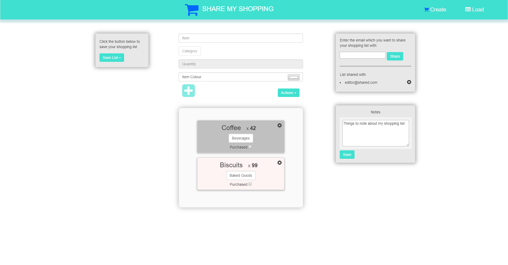

# Share My Shopping

This repository contains the code-base for a shopping list website, **Share My Shopping**, that is hosted as an Azure App service. The website can be accessed [here](http://sharemyshopping.azurewebsites.net/).

The user story map used in the project can be accessed [here](https://sharemyshopping.storiesonboard.com/m/guidemap). GitHub's Projects was used to manage collaborative development

MySQL in App service is utilized for server persistence.

## Share My Shopping Demonstration

